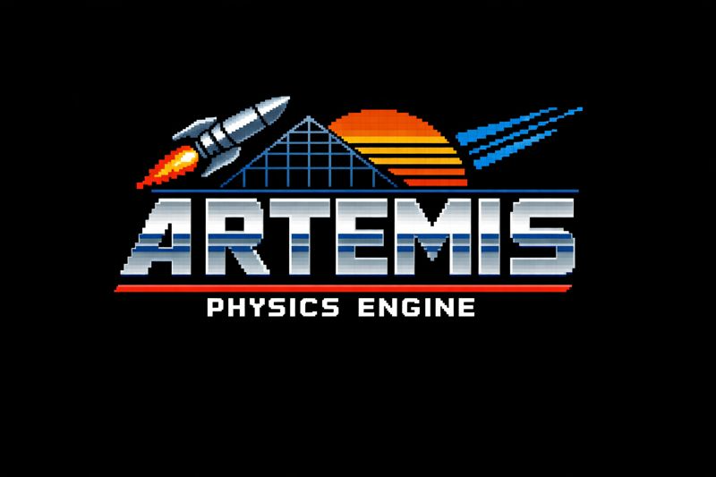

# Artemis Physics Engine

<p align="center">
  
</p>

A high-performance, multi-threaded physics engine for C# with GPU acceleration, SIMD optimization, and comprehensive 2D/3D simulation capabilities.

[](https://dotnet.microsoft.com)
[](LICENSE)

---

## Table of Contents

- [Features](#features)
- [Installation](#installation)
- [Quick Start](#quick-start)
- [Core API](#core-api)
  - [Vector Types](#vector-types)
  - [Physics World](#physics-world)
  - [Rigid Bodies](#rigid-bodies)
  - [Collision Shapes](#collision-shapes)
- [Physics2D API](#physics2d-api)
  - [PhysicsWorld2D](#physicsworld2d)
  - [RigidBody2D](#rigidbody2d)
  - [Shapes](#shapes-2d)
  - [Joints & Constraints](#joints--constraints)
  - [Area Effectors](#area-effectors)
- [Particle Systems](#particle-systems)
  - [Basic Particles](#basic-particles)
  - [Sand Simulation](#sand-simulation)
  - [Fluid Simulation (SPH)](#fluid-simulation-sph)
  - [Particle Collider](#particle-collider-lhc-style)
- [Force Systems](#force-systems)
- [Collision Detection](#collision-detection)
- [GPU Acceleration](#gpu-acceleration)
- [Materials](#materials)
- [Performance Optimization](#performance-optimization)
- [Advanced Topics](#advanced-topics)
- [API Reference](#api-reference)

---

## Features

- **Multi-threaded Physics** - Parallel collision detection and constraint solving
- **SIMD Optimization** - Structure of Arrays (SoA) layout for vectorized operations
- **GPU Acceleration** - OpenCL, CUDA, Vulkan, DirectCompute, Metal backends
- **2D & 3D Physics** - Complete engines for both dimensions
- **Particle Systems** - Sand, fluid (SPH), fire, smoke simulations
- **Force Systems** - Gravity, wind, buoyancy, magnetism, vortex, explosions
- **Continuous Collision Detection** - Prevents tunneling for fast objects
- **Spatial Hashing** - O(n) broad-phase collision detection
- **Cloth Simulation** - Real-time deformable cloth with tearing
- **Scientific Accuracy** - Energy tracking, RK4 integration, data export

---

## Installation

### NuGet Package
```bash
dotnet add package Artemis.Physics
```

### Project Reference
```xml
<ItemGroup>
  <ProjectReference Include="path/to/Artemis.csproj" />
</ItemGroup>
```

### Requirements
- .NET 6.0, 7.0, or 8.0
- Optional: GPU with OpenCL/CUDA support for acceleration

---

## Quick Start

### 3D Physics World

```csharp
using Artemis.Simulation;
using Artemis.Core;
using Artemis.Bodies;

// Create a physics world with Earth gravity
var world = new PhysicsWorld();
world.Gravity = new Vector3D(0, -9.81, 0);

// Create a dynamic sphere
var sphere = RigidBody.CreateSphere(
    position: new Vector3D(0, 10, 0),
    radius: 1.0,
    mass: 5.0
);
world.AddBody(sphere);

// Create a static ground plane
var ground = RigidBody.CreateStaticBox(
    position: new Vector3D(0, 0, 0),
    halfExtents: new Vector3D(50, 0.5, 50)
);
world.AddBody(ground);

// Simulation loop
while (running)
{
    world.Step(1.0 / 60.0); // 60 FPS physics
    Console.WriteLine($"Sphere position: {sphere.Position}");
}
```

### 2D Physics World

```csharp
using Artemis.Physics2D;
using Artemis.Physics2D.Particles;

// Create 2D physics world (no gravity for space simulation)
var world = new PhysicsWorld2D(Vector2D.Zero);
world.UseCCD = true; // Enable continuous collision detection

// Create a dynamic circle
var circle = RigidBody2D.CreateCircle(
    position: new Vector2D(0, 0),
    radius: 1.0,
    density: 1.0
);
world.AddBody(circle);

// Apply initial velocity
circle.Velocity = new Vector2D(10, 5);

// Simulation loop
while (running)
{
    world.Step(1.0 / 60.0);
}
```

---

## Core API

### Vector Types

#### Vector3D
High-precision 3D vector for physics calculations.

```csharp
using Artemis.Core;

// Creation
var v1 = new Vector3D(1, 2, 3);
var v2 = Vector3D.Zero;
var v3 = Vector3D.Up; // (0, 1, 0)

// Properties
double length = v1.Magnitude;
double lengthSq = v1.MagnitudeSquared; // Faster, no sqrt
Vector3D normalized = v1.Normalized;

// Operations
Vector3D sum = v1 + v2;
Vector3D scaled = v1 * 2.0;
double dot = Vector3D.Dot(v1, v2);
Vector3D cross = Vector3D.Cross(v1, v2);
double distance = Vector3D.Distance(v1, v2);

// Interpolation
Vector3D lerped = Vector3D.Lerp(v1, v2, 0.5);
```

#### Vector2D
2D vector for Physics2D module.

```csharp
using Artemis.Physics2D;

var v = new Vector2D(3, 4);
double magnitude = v.Magnitude; // 5.0

// Create from angle
var direction = Vector2D.FromAngle(Math.PI / 4); // 45 degrees
var withLength = Vector2D.FromAngle(Math.PI / 4, 10.0); // length 10

// Properties
double angle = v.Angle; // Radians
Vector2D perpendicular = v.Perpendicular;
```

#### Quaternion
Rotation without gimbal lock.

```csharp
using Artemis.Core;

// From axis-angle
var rotation = Quaternion.FromAxisAngle(Vector3D.Up, Math.PI / 2);

// From Euler angles (in radians)
var euler = Quaternion.FromEuler(pitch: 0, yaw: Math.PI/4, roll: 0);

// Interpolation
var slerped = Quaternion.Slerp(q1, q2, t);

// Apply rotation to vector
Vector3D rotated = rotation * vector;

// Combine rotations
Quaternion combined = q1 * q2;
```

### Physics World

The main 3D simulation container.

```csharp
using Artemis.Simulation;

var world = new PhysicsWorld();

// Configuration
world.Gravity = new Vector3D(0, -9.81, 0);
world.FixedTimeStep = 1.0 / 60.0;
world.MaxSubSteps = 8;
world.UseCCD = true;
world.RestitutionThreshold = 0.5;

// Body management
world.AddBody(body);
world.RemoveBody(body);

// Force management
world.AddForce(gravityForce);

// Spatial queries
var bodiesInRegion = world.GetBodiesInRegion(aabb);
var rayHit = world.RaycastClosest(ray);

// Events
world.OnCollision += (info) => {
    Console.WriteLine($"Collision: {info.BodyA.Id} hit {info.BodyB.Id}");
};

// Simulation
world.Step(deltaTime);

// Properties
double totalTime = world.TotalTime;
long steps = world.StepCount;
var collisions = world.LastCollisions;
```

### Rigid Bodies

```csharp
using Artemis.Bodies;

// Factory methods
var sphere = RigidBody.CreateSphere(position, radius, mass);
var box = RigidBody.CreateBox(position, halfExtents, mass);
var staticBox = RigidBody.CreateStaticBox(position, halfExtents);

// Body types
body.BodyType = BodyType.Dynamic;   // Fully simulated
body.BodyType = BodyType.Static;    // Immovable
body.BodyType = BodyType.Kinematic; // User-controlled

// Properties
body.Position = new Vector3D(0, 10, 0);
body.Velocity = new Vector3D(5, 0, 0);
body.Rotation = Quaternion.Identity;
body.AngularVelocity = new Vector3D(0, 1, 0);
body.Mass = 10.0;
body.LinearDamping = 0.1;
body.AngularDamping = 0.1;

// Apply forces
body.ApplyForce(new Vector3D(0, 100, 0));           // At center of mass
body.ApplyForceAtPoint(force, worldPoint);          // At specific point
body.ApplyImpulse(new Vector3D(0, 50, 0));          // Instant velocity change
body.ApplyTorque(new Vector3D(0, 10, 0));           // Rotational force

// Sleep system
body.CanSleep = true;
if (body.IsSleeping) body.WakeUp();

// Custom data
body.UserData = myGameObject;
```

### Collision Shapes

```csharp
using Artemis.Collision;

// Shape types
public enum CollisionShapeType
{
    Sphere,
    Box,
    Capsule,
    Cylinder,
    Mesh
}

// Collision filtering
body.Filter = new CollisionFilter
{
    Layer = CollisionLayers.Player,
    Mask = CollisionLayers.Enemy | CollisionLayers.Ground,
    Group = 0
};

// Predefined layers
CollisionLayers.Default    // Layer 0
CollisionLayers.Static     // Layer 1
CollisionLayers.Dynamic    // Layer 2
CollisionLayers.Player     // Layer 3
CollisionLayers.Enemy      // Layer 4
CollisionLayers.Projectile // Layer 5
CollisionLayers.Trigger    // Layer 6
```

---

## Physics2D API

### PhysicsWorld2D

Multi-threaded 2D physics with spatial hashing and GPU support.

```csharp
using Artemis.Physics2D;

// Create world
var world = new PhysicsWorld2D(gravity: new Vector2D(0, -9.81));

// Configuration
world.VelocityIterations = 8;
world.PositionIterations = 3;
world.AllowSleep = true;
world.UseCCD = true;
world.UseGPU = true; // Enable GPU acceleration

// Body management
world.AddBody(body);
world.RemoveBody(body);

// Joints
world.AddJoint(revoluteJoint);

// Area effectors
world.AddAreaEffector(windZone);

// Events
world.CollisionBegin += (sender, e) => {
    Console.WriteLine($"Collision started: {e.BodyA.Id} vs {e.BodyB.Id}");
};

world.TriggerEnter += (sender, e) => {
    Console.WriteLine($"Entered trigger zone");
};

// Simulation
world.Step(1.0 / 60.0);

// Queries
var hit = world.RaycastClosest(origin, direction, maxDistance);
var bodies = world.GetBodiesInAABB(aabb);
```

### RigidBody2D

```csharp
using Artemis.Physics2D;

// Creation
var circle = RigidBody2D.CreateCircle(position, radius, density);
var box = RigidBody2D.CreateBox(position, width, height, density);

// Body types
body.BodyType = BodyType2D.Dynamic;
body.BodyType = BodyType2D.Static;
body.BodyType = BodyType2D.Kinematic;

// Properties
body.Position = new Vector2D(10, 20);
body.Velocity = new Vector2D(5, 0);
body.Rotation = Math.PI / 4;        // Radians
body.AngularVelocity = 1.0;         // Radians/second
body.Mass = 10.0;
body.Inertia = 100.0;               // Rotational inertia
body.LinearDamping = 0.1;
body.AngularDamping = 0.1;

// Collision
body.IsBullet = true;               // Use CCD for high-speed
body.CategoryBits = 0x0001;         // Collision layer
body.MaskBits = 0xFFFF;             // Collides with all

// Forces
body.ApplyForce(new Vector2D(100, 0));
body.ApplyForceAtPoint(force, point);
body.ApplyImpulse(impulse);
body.ApplyTorque(10.0);

// User data
body.UserData = myGameObject;
```

### Shapes (2D)

```csharp
using Artemis.Physics2D;

// Circle shape
var circle = new CircleShape(radius: 1.0);

// Box shape
var box = new BoxShape(width: 2.0, height: 1.0);

// Polygon shape
var polygon = new PolygonShape(vertices);

// Capsule shape
var capsule = new CapsuleShape(width: 2.0, height: 4.0);

// Edge shape (static geometry)
var edge = new EdgeShape(start, end);

// Chain shape (connected edges)
var chain = new ChainShape(vertices, isLoop: true);
```

### Joints & Constraints

```csharp
using Artemis.Physics2D;

// Distance Joint - fixed distance between bodies
var distanceJoint = new DistanceJoint2D(bodyA, bodyB, distance: 5.0);
distanceJoint.Stiffness = 1000.0;
distanceJoint.Damping = 10.0;
world.AddJoint(distanceJoint);

// Revolute Joint - rotation around a point (hinge)
var revoluteJoint = new RevoluteJoint2D(bodyA, bodyB, anchor);
revoluteJoint.EnableMotor = true;
revoluteJoint.MotorSpeed = 2.0;
revoluteJoint.MaxMotorTorque = 100.0;
revoluteJoint.EnableLimit = true;
revoluteJoint.LowerAngle = -Math.PI / 4;
revoluteJoint.UpperAngle = Math.PI / 4;
world.AddJoint(revoluteJoint);

// Spring Joint - elastic connection
var springJoint = new SpringJoint2D(bodyA, bodyB, restLength: 3.0);
springJoint.SpringConstant = 500.0;
springJoint.Damping = 5.0;
world.AddJoint(springJoint);

// Rope Joint - maximum distance constraint
var ropeJoint = new RopeJoint2D(bodyA, bodyB, maxLength: 10.0);
world.AddJoint(ropeJoint);

// Weld Joint - fixed relative position
var weldJoint = new WeldJoint2D(bodyA, bodyB, anchor);
world.AddJoint(weldJoint);
```

### Area Effectors

```csharp
using Artemis.Physics2D;

// Radial Force (attraction/repulsion)
var gravityWell = new RadialForceEffector2D(
    center: new Vector2D(0, 0),
    radius: 20.0,
    strength: -100.0,            // Negative = attraction
    falloff: RadialFalloff2D.InverseSquare
);
world.AddAreaEffector(gravityWell);

// Directional Force (wind)
var wind = new DirectionalForceEffector2D(
    position: new Vector2D(0, 0),
    radius: 50.0,
    direction: new Vector2D(1, 0),
    strength: 50.0
);
world.AddAreaEffector(wind);

// Vortex (tornado/whirlpool)
var vortex = new VortexEffector2D(
    center: new Vector2D(0, 0),
    radius: 15.0,
    strength: 30.0,
    clockwise: true
);
world.AddAreaEffector(vortex);

// Magnetic Field (for charged particles)
var magneticField = new MagneticFieldEffector2D(
    center: new Vector2D(0, 0),
    radius: 25.0,
    fieldStrength: 10.0
);
magneticField.IsUniform = false; // Radial variation
world.AddAreaEffector(magneticField);

// Buoyancy (water simulation)
var water = new BuoyancyEffector2D(
    position: new Vector2D(0, -10),
    radius: 100.0,
    surfaceY: 0.0,
    fluidDensity: 1000.0
);
water.Drag = 0.5;
world.AddAreaEffector(water);
```

---

## Particle Systems

### Basic Particles

```csharp
using Artemis.Particles;

// Create particle system
var particles = new ParticleSystem(maxParticles: 10000);

// Configuration
particles.Gravity = new Vector3D(0, -9.81, 0);
particles.Damping = 0.01;
particles.DefaultLifetime = 5.0;
particles.DefaultRadius = 0.1;
particles.UseVerletIntegration = true;
particles.EnableParticleCollisions = true;

// Emit particles
particles.Emit(
    position: new Vector3D(0, 10, 0),
    velocity: new Vector3D(0, 5, 0),
    count: 100,
    mass: 1.0,
    radius: 0.1,
    lifetime: 3.0,
    color: 0xFFFF0000  // ARGB red
);

// Events
particles.OnParticleDeath += (particle) => {
    // Spawn effect, play sound, etc.
};

// Update
particles.Update(deltaTime);

// Access particles
foreach (var p in particles.GetAliveParticles())
{
    Console.WriteLine($"Position: {p.Position}, Lifetime: {p.Lifetime}");
}
```

### Sand Simulation

High-performance granular material simulation with multi-threading and GPU support.

```csharp
using Artemis.Particles;

// Create sand simulation
var bounds = new AABB(
    min: new Vector3D(-50, -50, -50),
    max: new Vector3D(50, 50, 50)
);
var sand = new SandSimulation(bounds, cellSize: 1.0);

// Configuration
sand.Gravity = new Vector3D(0, -9.81, 0);
sand.Friction = 0.5;
sand.Restitution = 0.3;
sand.ParticleRadius = 0.2;
sand.UseGPU = true;
sand.MaxThreads = Environment.ProcessorCount;

// Add particles
sand.AddParticles(
    count: 50000,
    position: new Vector3D(0, 20, 0),
    velocity: Vector3D.Zero,
    radius: 0.2
);

// Simulation loop
sand.Update(deltaTime);

// Get particle data for rendering
var particles = sand.GetParticleList();
foreach (var p in particles)
{
    RenderParticle(p.Position, p.Radius, p.Color);
}

// Cleanup settled particles
sand.ClearSettled();
```

### Fluid Simulation (SPH)

Smoothed Particle Hydrodynamics for realistic fluid behavior.

```csharp
using Artemis.Particles;

// Create fluid simulation
var bounds = new AABB(min, max);
var fluid = new FluidSimulation(bounds, cellSize: 1.0);

// SPH Parameters
fluid.Gravity = new Vector3D(0, -9.81, 0);
fluid.RestDensity = 1000.0;     // Water density (kg/m³)
fluid.GasConstant = 2000.0;     // Pressure stiffness
fluid.Viscosity = 0.001;        // Dynamic viscosity
fluid.SurfaceTension = 0.0728;  // Water surface tension
fluid.SmoothingRadius = 1.5;    // Interaction distance

// Add fluid particles
fluid.AddParticles(
    count: 10000,
    position: new Vector3D(0, 10, 0),
    velocity: Vector3D.Zero
);

// Add colliders (rigid bodies)
fluid.AddCollider(rigidBody);

// Simulation
fluid.Update(deltaTime);

// Access particle data
foreach (var p in fluid.GetParticleList())
{
    Console.WriteLine($"Pos: {p.Position}, Density: {p.Density}, Pressure: {p.Pressure}");
}
```

### Particle Collider (LHC-Style)

Scientific particle physics simulation.

```csharp
using Artemis.Physics2D.Particles;

// Particle types
public enum ParticleType
{
    Proton,      // Heavy, +1 charge
    Electron,    // Light, -1 charge
    Positron,    // Antimatter electron
    Neutron,     // Neutral
    Photon,      // Massless
    Higgs,       // Higgs boson
    Quark,       // Fundamental
    Muon,        // Heavy electron
    Neutrino,    // Nearly massless
    Pion         // Composite
}

// Create accelerator
var accelerator = new Accelerator2D(
    center: Vector2D.Zero,
    radius: 27.0,         // Like LHC's 27km
    beamEnergy: 6500.0    // GeV
);

// Inject particle beams
accelerator.InjectBeam1(ParticleType.Proton, count: 100);
accelerator.InjectBeam2(ParticleType.Proton, count: 100);

// Create experiment
var experiment = new CollisionExperiment2D("ARTEMIS", accelerator);

// Setup detectors (ATLAS, CMS style)
foreach (var detector in experiment.Detectors)
{
    Console.WriteLine($"Detector: {detector.Name}, Type: {detector.Type}");
}

// Register with physics world
world.AddAreaEffector(accelerator.GetMagneticField());

// Simulation loop
accelerator.UpdateParticlesParallel(deltaTime);
accelerator.ApplyBeamFocusingParallel(deltaTime);
accelerator.ApplyRFAccelerationParallel(deltaTime, phase);

// Handle collisions
world.CollisionBegin += (sender, e) => {
    if (e.BodyA.UserData is Particle2D p1 && e.BodyB.UserData is Particle2D p2)
    {
        experiment.RecordCollision(p1, p2, collisionPoint);
    }
};

// Get statistics
var (beam1Count, beam2Count, avgEnergy, luminosity) = accelerator.GetStatistics();
Console.WriteLine($"Luminosity: {luminosity:E2} cm⁻²s⁻¹");

// Export data
var exporter = new SimulationDataExporter2D();
exporter.RecordFrame(accelerator.GetAllParticles(), deltaTime);
string csv = exporter.ExportToCSV();
```

---

## Force Systems

### Gravity Force

```csharp
using Artemis.Forces;

// Uniform gravity
var gravity = new GravityForce("earth-gravity");
gravity.Gravity = new Vector3D(0, -9.81, 0);
world.AddForce(gravity);

// Presets
var moonGravity = GravityForce.Moon("moon");      // 1.62 m/s²
var marsGravity = GravityForce.Mars("mars");      // 3.72 m/s²
var zeroG = GravityForce.ZeroG("zero");           // 0

// Point gravity (planets, stars)
var planet = new PointGravityForce("planet");
planet.Position = new Vector3D(0, 0, 0);
planet.Mass = 5.972e24;  // Earth mass
planet.GravitationalConstant = 6.67430e-11;
planet.MinDistance = 100.0;  // Prevent singularity
world.AddForce(planet);
```

### Wind Force

```csharp
var wind = new WindForce("wind");
wind.Direction = new Vector3D(1, 0, 0).Normalized;
wind.Strength = 50.0;
wind.Turbulence = 0.3;        // 0-1, adds randomness
wind.GustFrequency = 0.5;     // Gusts per second
wind.GustStrength = 20.0;
wind.DragCoefficient = 0.5;
world.AddForce(wind);

// Update gusts in game loop
wind.UpdateGusts(deltaTime);

// Presets
var breeze = WindForce.Breeze("breeze");
var storm = WindForce.Storm("storm");
```

### Buoyancy Force

```csharp
var water = new BuoyancyForce("water");
water.SurfaceHeight = 0.0;
water.FluidDensity = 1000.0;  // Water
water.FluidDrag = 2.0;
water.CurrentVelocity = new Vector3D(0.5, 0, 0);
world.AddForce(water);

// Presets
var freshWater = BuoyancyForce.FreshWater("lake");
var saltWater = BuoyancyForce.SaltWater("ocean");
var oil = BuoyancyForce.Oil("oil-tank");
```

### Explosion Force

```csharp
var explosion = new ExplosionForce("boom");
explosion.Center = new Vector3D(0, 0, 0);
explosion.Force = 5000.0;
explosion.Radius = 20.0;
explosion.UpwardBias = 0.5;     // Ground reflection
explosion.Duration = 0.5;
explosion.FalloffPower = 2.0;   // Inverse square
explosion.ShockwaveSpeed = 50.0;
world.AddForce(explosion);

// Trigger explosion
explosion.Explode(new Vector3D(10, 0, 10));

// Update in game loop
explosion.Update(deltaTime);

// Presets
var grenade = ExplosionForce.Grenade("frag");
var nuclear = ExplosionForce.Nuclear("nuke");
var implosion = ExplosionForce.Implosion("singularity");
```

### Vortex Force

```csharp
var tornado = new VortexForce("tornado");
tornado.Center = new Vector3D(0, 0, 0);
tornado.Axis = Vector3D.Up;
tornado.TangentialStrength = 100.0;  // Rotation
tornado.RadialStrength = -30.0;      // Inward pull
tornado.AxialStrength = 20.0;        // Upward lift
tornado.InnerRadius = 2.0;
tornado.OuterRadius = 20.0;
tornado.Height = 50.0;
world.AddForce(tornado);

// Presets
var whirlpool = VortexForce.Whirlpool("whirlpool");
var dustDevil = VortexForce.DustDevil("dust");
var drain = VortexForce.Drain("drain");
```

### Magnetic Force

```csharp
var magnet = new MagneticForce("electromagnet");
magnet.Position = new Vector3D(0, 5, 0);
magnet.DipoleMoment = 1000.0;
magnet.PoleDirection = Vector3D.Down;
magnet.IsElectromagnet = true;
magnet.Current = 10.0;  // Amperes
world.AddForce(magnet);

// Toggle attraction/repulsion
magnet.IsAttracting = !magnet.IsAttracting;

// Presets
var industrial = MagneticForce.Industrial("crane");
```

---

## Collision Detection

### Collision Info

```csharp
using Artemis.Collision;

world.OnCollision += (info) => {
    // Bodies involved
    IPhysicsBody bodyA = info.BodyA;
    IPhysicsBody bodyB = info.BodyB;

    // Collision details
    Vector3D normal = info.Normal;           // A to B
    double penetration = info.Penetration;
    Vector3D contactPoint = info.ContactPoint;

    // Example: Apply damage based on impact
    double impactSpeed = (bodyA.Velocity - bodyB.Velocity).Magnitude;
    if (impactSpeed > 10.0)
    {
        ApplyDamage(bodyA, impactSpeed);
    }
};
```

### Raycasting

```csharp
using Artemis.Core;

// Single raycast
var ray = new Ray(origin, direction, maxDistance: 100.0);
var hit = world.RaycastClosest(ray);

if (hit.HasHit)
{
    Vector3D point = hit.Point;
    Vector3D normal = hit.Normal;
    double distance = hit.Distance;
    IPhysicsBody body = hit.Body;

    // Apply impulse at hit point
    body.ApplyImpulseAtPoint(normal * 50.0, point);
}

// Multiple hits
var allHits = world.RaycastAll(ray);
foreach (var h in allHits)
{
    Console.WriteLine($"Hit {h.Body.Id} at distance {h.Distance}");
}

// With layer filtering
var filteredHit = world.RaycastClosest(ray, layerMask: CollisionLayers.Enemy);
```

### Trigger Zones

```csharp
using Artemis.Bodies;

// Create trigger
var trigger = TriggerBody.CreateBox(
    position: new Vector3D(0, 0, 0),
    halfExtents: new Vector3D(5, 5, 5)
);
world.AddBody(trigger);

// Events
trigger.OnTriggerEnter += (body) => {
    Console.WriteLine($"{body.Id} entered zone");
    // Activate trap, start cutscene, etc.
};

trigger.OnTriggerStay += (body) => {
    // Apply damage over time
    ApplyDamageOverTime(body, deltaTime);
};

trigger.OnTriggerExit += (body) => {
    Console.WriteLine($"{body.Id} left zone");
};

// Sensor zones (apply forces)
var slowZone = SensorBody.SlowZone(position, size, slowFactor: 0.5);
var windZone = SensorBody.WindZone(position, size, windForce);
var antiGravity = SensorBody.AntiGravityZone(position, size, strength: 20.0);
```

---

## GPU Acceleration

### Setup

```csharp
using Artemis.Compute;

// Create GPU compute instance
var gpu = new GpuCompute(GpuBackend.Auto);

// Check availability
if (gpu.IsAvailable)
{
    Console.WriteLine($"GPU: {gpu.DeviceInfo.Name}");
    Console.WriteLine($"Backend: {gpu.ActiveBackend}");
    Console.WriteLine($"Memory: {gpu.DeviceInfo.TotalMemory / 1024 / 1024} MB");
    Console.WriteLine($"Compute Units: {gpu.DeviceInfo.ComputeUnits}");
}

// List all devices
foreach (var device in gpu.AvailableDevices)
{
    Console.WriteLine($"[{device.DeviceId}] {device.Name} ({device.Backend})");
}

// Select specific device
gpu.SelectDevice(deviceId: 0);
```

### GPU Backends

```csharp
public enum GpuBackend
{
    Auto,           // Auto-detect best available
    OpenCL,         // Intel/AMD/NVIDIA
    CUDA,           // NVIDIA GPUs
    Vulkan,         // Cross-platform compute
    DirectCompute,  // Windows DirectX 12
    Metal,          // macOS/iOS
    CPU             // SIMD fallback
}
```

### GPU Particle Updates

```csharp
// Enable GPU in physics world
world.UseGPU = true;

// Or use GPU compute directly
gpu.UpdateParticles(
    particles: particleArray,
    deltaTime: dt,
    gravity: new Vector3D(0, -9.81, 0)
);

// GPU collision detection
var collisions = gpu.ComputeParticleCollisions(
    particles: particleArray,
    cellSize: 1.0
);

// GPU body integration
gpu.IntegrateBodies(
    positions: positionArray,
    velocities: velocityArray,
    forces: forceArray,
    masses: massArray,
    deltaTime: dt
);

// GPU SPH fluid simulation
gpu.ComputeSPH(
    particles: fluidParticles,
    smoothingRadius: 1.5,
    restDensity: 1000.0,
    stiffness: 2000.0
);
```

### Structure of Arrays (SoA)

Optimized memory layout for SIMD and GPU operations.

```csharp
using Artemis.Compute;

// SoA particle data
var soa = new ParticleSoA(count: 100000);

// Access arrays directly
float[] posX = soa.PositionX;
float[] posY = soa.PositionY;
float[] posZ = soa.PositionZ;
float[] velX = soa.VelocityX;
float[] velY = soa.VelocityY;
float[] velZ = soa.VelocityZ;
float[] mass = soa.Mass;
uint[] color = soa.Color;

// SIMD-friendly iteration
for (int i = 0; i < soa.Count; i += Vector<float>.Count)
{
    // Process Vector<float>.Count particles at once
    var vx = new Vector<float>(velX, i);
    var vy = new Vector<float>(velY, i);
    // ...
}
```

---

## Materials

### Physics Material

```csharp
using Artemis.Materials;

var steel = new PhysicsMaterial("Steel")
{
    Density = 7850.0,                // kg/m³
    Restitution = 0.6,               // Bounciness
    StaticFriction = 0.74,
    DynamicFriction = 0.57,
    YoungsModulus = 200e9,           // 200 GPa
    PoissonRatio = 0.3,
    YieldStrength = 250e6,           // 250 MPa
    UltimateTensileStrength = 400e6
};

body.Material = steel;

// Material presets
body.Material = MaterialPresets.Steel();
body.Material = MaterialPresets.Rubber();
body.Material = MaterialPresets.Wood();
body.Material = MaterialPresets.Ice();
body.Material = MaterialPresets.Glass();
body.Material = MaterialPresets.Concrete();

// Combine materials (for collision response)
var combined = PhysicsMaterial.Combine(materialA, materialB);

// Check fracture
double stress = 500e6; // Pascals
if (steel.WouldFracture(stress))
{
    // Trigger destruction
}
```

---

## Performance Optimization

### Spatial Hashing

```csharp
using Artemis.Simulation;

// Configure spatial hash
var spatialHash = new SpatialHash(cellSize: 2.0);

// Insert bodies
foreach (var body in bodies)
{
    spatialHash.Insert(body);
}

// Query region
var nearby = spatialHash.Query(queryAABB, results);

// Statistics
Console.WriteLine($"Occupied cells: {spatialHash.OccupiedCellCount}");
Console.WriteLine($"Queries: {spatialHash.QueryCount}");
```

### Island Solver

```csharp
using Artemis.Simulation;

// Partition bodies into independent islands for parallel solving
var islandSolver = new IslandSolver(maxBodies: 1000);
islandSolver.BuildIslands(bodies, collisions);

// Solve islands in parallel
Parallel.ForEach(islandSolver.GetIslandsForParallel(), island => {
    SolveIsland(island);
});
```

### Sleeping Bodies

```csharp
// Configure sleeping
body.CanSleep = true;
world.AllowSleep = true;

// Manual wake
if (body.IsSleeping)
{
    body.WakeUp();
}

// Sleep thresholds are defined in PhysicsConstants
PhysicsConstants.DefaultSleepVelocityThreshold;        // 0.05
PhysicsConstants.DefaultSleepAngularVelocityThreshold; // 0.05
PhysicsConstants.DefaultSleepTimeThreshold;            // 0.5 seconds
```

### Parallel Physics

```csharp
using Artemis.Simulation;

var processor = new ParallelPhysicsProcessor(
    threadCount: 0  // 0 = auto-detect
);

processor.UseSIMD = true;
processor.MinBatchSize = 64;

// Parallel integration
processor.IntegrateBodies(bodies, forces, deltaTime);

// Parallel collision detection
var pairs = processor.DetectCollisionsParallel(bodies);
```

---

## Advanced Topics

### Cloth Simulation

```csharp
using Artemis.Simulation;

// Create cloth
var cloth = new ClothSimulation(
    width: 20,
    height: 20,
    spacing: 0.5
);

// Material
cloth.Material = ClothMaterial.Cotton();
// Or: Silk(), Denim(), Leather(), Rubber(), Flag()

cloth.Gravity = new Vector3D(0, -9.81, 0);
cloth.AllowTearing = true;

// Pin corners
cloth.PinParticle(0, topLeftPosition);
cloth.PinParticle(19, topRightPosition);

// Simulation
cloth.Step(deltaTime);

// Apply external forces
cloth.ApplyForce(windForce);

// Access particles for rendering
var particles = cloth.GetParticles();
```

### Energy Tracking

```csharp
using Artemis.Physics2D.Particles;

var tracker = new EnergyTracker2D();
tracker.GravityMagnitude = 9.81;

// Track energy each frame
tracker.UpdateEnergy(world.Bodies);

// Get values
double kinetic = tracker.KineticEnergy;
double potential = tracker.PotentialEnergy;
double rotational = tracker.RotationalEnergy;
double total = tracker.TotalEnergy;

// Check conservation
double drift = tracker.GetEnergyDrift();
double driftPercent = tracker.GetEnergyDriftPercentage();

if (driftPercent > 1.0)
{
    Console.WriteLine("Warning: Energy conservation violated!");
}
```

### Data Export

```csharp
using Artemis.Physics2D.Particles;

var exporter = new SimulationDataExporter2D();

// Record frames during simulation
foreach (var frame in simulation)
{
    exporter.RecordFrame(particles, deltaTime);
}

// Export to CSV
string csv = exporter.ExportToCSV();
File.WriteAllText("simulation_data.csv", csv);

// CSV columns:
// Time, ParticleId, Type, PosX, PosY, VelX, VelY, Energy, Momentum, Charge
```

---

## API Reference

### Namespaces

| Namespace | Description |
|-----------|-------------|
| `Artemis.Core` | Math types, constants, transforms |
| `Artemis.Bodies` | Rigid bodies, triggers, sensors |
| `Artemis.Collision` | Detection and resolution |
| `Artemis.Simulation` | Physics worlds, solvers |
| `Artemis.Forces` | Force generators |
| `Artemis.Particles` | Particle systems |
| `Artemis.Physics2D` | 2D physics engine |
| `Artemis.Physics2D.Particles` | 2D particle physics |
| `Artemis.Compute` | GPU acceleration |
| `Artemis.Materials` | Physical materials |

### Key Classes

| Class | Purpose |
|-------|---------|
| `PhysicsWorld` | 3D physics simulation |
| `PhysicsWorld2D` | 2D physics simulation |
| `RigidBody` / `RigidBody2D` | Physics objects |
| `Vector3D` / `Vector2D` | Math vectors |
| `Quaternion` | 3D rotations |
| `ParticleSystem` | Basic particles |
| `SandSimulation` | Granular physics |
| `FluidSimulation` | SPH fluids |
| `GpuCompute` | GPU acceleration |
| `PhysicsMaterial` | Material properties |
| `Accelerator2D` | Particle collider |

---

## License

MIT License - See [LICENSE](LICENSE) for details.

---

## Contributing

Contributions welcome! Please read our contributing guidelines before submitting PRs.

---

*Artemis Physics Engine - High-performance physics for games and simulations*
